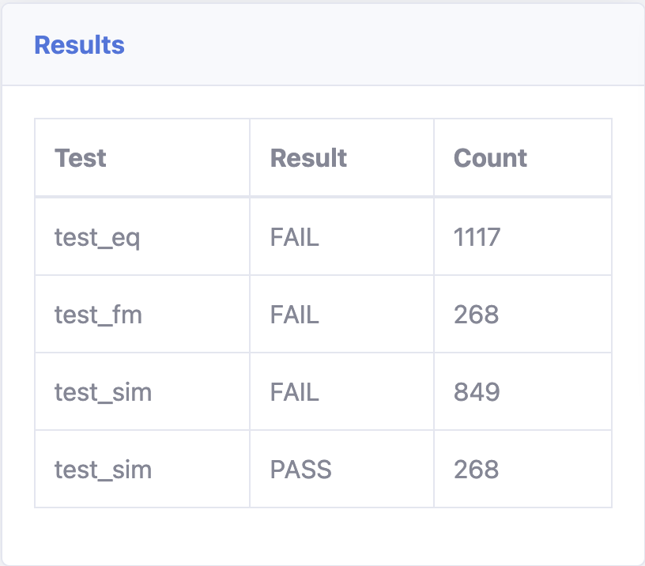
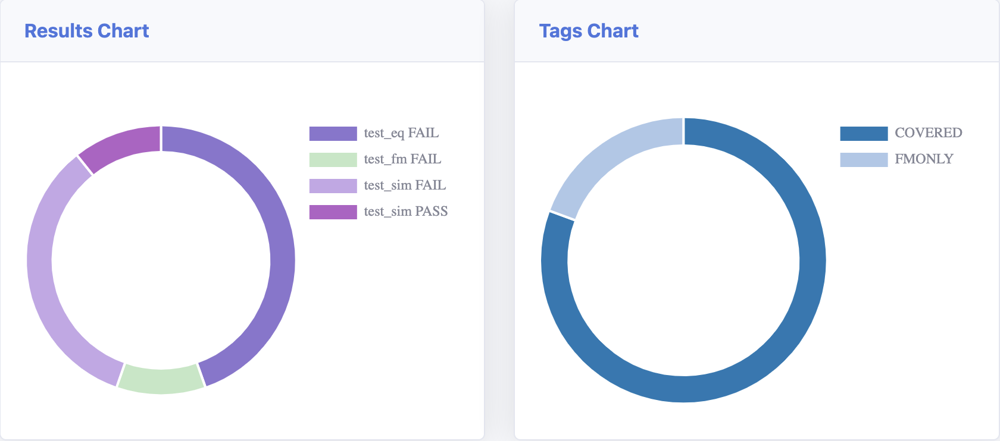

# Average Filter Module

This Verilog module implements a pipelined 2-sample average filter. It takes a stream of <DATA_WIDTH>-bit signed data and outputs the average of the current and previous sample.

## Features

* Pipelined design for high throughput.
* Supports customizable DATA_WIDTH.
* Clock enable (CE) signal for flow control, both input and output.

## Requirements

Linux or macOS with [oss-cad-suite](https://github.com/YosysHQ/oss-cad-suite-build/releases) installed in `home/<username>/oss-cad-suite/`

## Usage

1. **Instantiate the module:**

   ```verilog
   parameter USER_DATA_WIDTH = 8;
   wire [USER_DATA_WIDTH-1:0] i_data;
   wire [USER_DATA_WIDTH-1:0] o_data;
   average_filter #(
       .DATA_WIDTH(USER_DATA_WIDTH)
   ) my_filter (
       .clk(clk),
       .reset_n(reset_n),
       .i_ce(i_ce),
       .data_in(i_data),
       .data_out(o_data),
       .o_ce(o_ce)
   );
   ```

## Validation

This module uses [`icarus verilog`](https://github.com/steveicarus/iverilog), [`symbiyosys`](https://github.com/YosysHQ/sby), [`equivalence checking wiht yosys`](https://github.com/YosysHQ/eqy) and [`mutation cover with yosys`](https://github.com/YosysHQ/mcy) to get a `100% mutation test coverage`!

Usage:

Linux/macOS
```bash
/$ cd test_rtl && ./test_all_log.sh
```

This will generate a `test_log.txt` in `test_rtl/`, and more logs in `<test_rtl/<dir>/average_filter/average_filter.txt`

```
Database contains 2502 cached results.
Database contains 1117 cached "FAIL" results for "test_eq".
Database contains 268 cached "FAIL" results for "test_fm".
Database contains 849 cached "FAIL" results for "test_sim".
Database contains 268 cached "PASS" results for "test_sim".
Tagged 1117 mutations as "COVERED".
Tagged 268 mutations as "FMONLY".
Coverage: 100.00%
```





## Synthesis

There's a little yosys synth script in `average_filter/test_rtl/synth/average_filter/average_filter.ys`for Tang Nano 20k, but it's untested.

```
=== average_filter ===

   Number of wires:                303
   Number of wire bits:            425
   Number of public wires:          29
   Number of public wire bits:      29
   Number of ports:                 20
   Number of port bits:             20
   Number of memories:               0
   Number of memory bits:            0
   Number of processes:              0
   Number of cells:                414
     $_MUX_                        176
     $_SDFFE_PN0P_                  24
     $_SDFF_PN0_                     2
     GND                           108
     IBUF                           11
     OBUF                            9
     VCC                            84
```

Also, there's a Tang Nano 9k Gowin IDE project in `average_filter/gowin/nano9k/average_filter.gprj`, to check STA, but also, sofar unused.